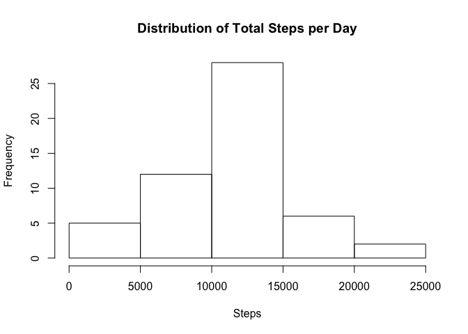
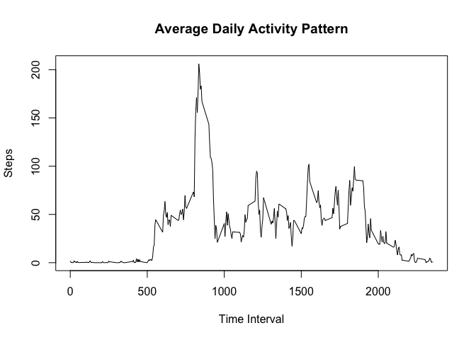
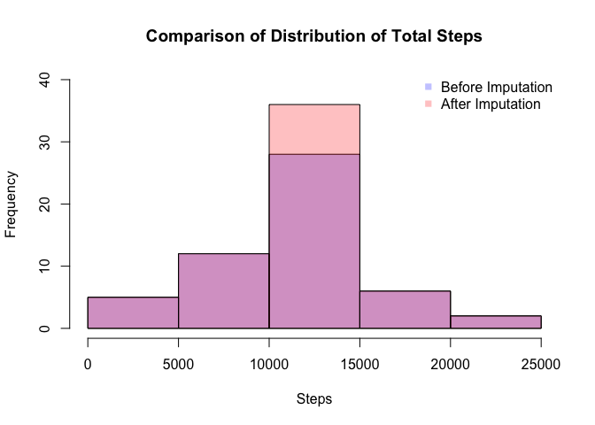
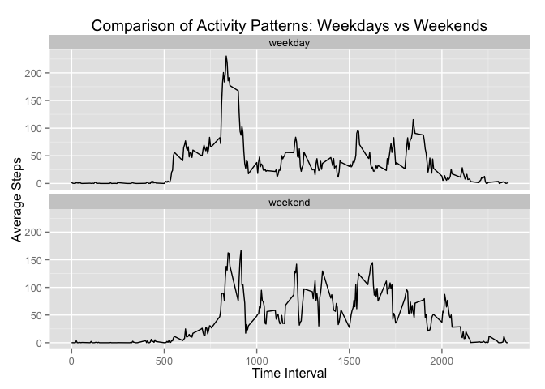

# Reproducible Research: Peer Assessment 1
## Introduction
This report analyses data from a personal activity monitoring device. This device collects data at 5 minute intervals through out the day. The data consists of two months of data from an anonymous individual collected during the months of October and November, 2012 and include the number of steps taken in 5 minute intervals each day. The original data set is available in the same Github repository as this report.

## Loading and preprocessing of the data
First the activity monitoring data set is read:

```r
activity <- read.csv("activity.csv")
```
## What is the mean total number of steps taken per day?
A histogram showing the distribution of *total* steps taken each day:

```r
## Loop through each day and sum the steps
total <- tapply(activity$steps, activity$date, sum)

## Then create a histogram of the total steps for each day, and store it in hist1
hist1 <- hist(total, main = "Distribution of Total Steps per Day", xlab = "Steps")
```

\

The mean and median number of steps taken each day (rounded to two decimal places) are summarised in the table below. NA values have been ignored for this calculation.

```r
## Get the mean and median total steps per day
mean <- mean(total, na.rm = TRUE)
median <- median(total, na.rm = TRUE)

## Display these results in a table
meanmed <- cbind(mean, median)
library(xtable)
xt <- xtable(meanmed, digits = 2)
print(xt, type = "html", include.rownames = FALSE)
```

<!-- html table generated in R 3.2.1 by xtable 1.8-0 package -->
<!-- Mon Jan 11 20:02:10 2016 -->
<table border=1>
<tr> <th> mean </th> <th> median </th>  </tr>
  <tr> <td align="right"> 10766.19 </td> <td align="right"> 10765.00 </td> </tr>
   </table>
## What is the average daily activity pattern?
The average daily activity pattern can be shown using a time series plot of the 5-minute interval and the average number of steps taken, averaged across all days. Again NA values have been ignored.

```r
## Loop through each time interval and get the average number of steps
intervalMean <- tapply(activity$steps, activity$interval, mean, na.rm = TRUE)

## Plot the average number of steps for each time interval
plot(unique(activity$interval), intervalMean, type = "l",
     main = "Average Daily Activity Pattern", xlab = "Time Interval", ylab = "Steps")
```

\


```r
## Find the highest average value. names() can be used to extract the time interval to which it relates
max <- which.max(intervalMean)
maxInterval <- names(max)
```
The 5-minute interval with the highest average number of steps (as calculated by the above code chunk) is 835. This corresponds with the spike in Steps in the above plot.

## Imputing missing values
First we need to know how many missing values are in our data set:

```r
NAs <- table(is.na(activity))[["TRUE"]]
```
This tells us that there are 2304 NA values in our data set.

Let's impute the missing values using the mean of the 5-minute inverval. We'll do this in a new data set called 'imputed'.

```r
## Copy activity into a new dataset called imputed
imputed <- activity

## Then loop through steps variable in each row, evaluating whether it is NA. If so, impute the mean stepcount corresponding to that row's 5-minute interval.
l <- length(imputed$steps)
for(i in 1:l) {
    if(is.na(imputed$steps[i] == TRUE)) {
        imputed$steps[i] <- intervalMean[[which(names(intervalMean)==imputed$interval[i])]]
    }
}
```
Now let's see if this changes the distribution of total steps taken each day. Here is a histogram showing the distribution of total steps taken each day for the data set with the **imputed** values.

```r
## Loop through each day and sum the steps
imputedTotal <- tapply(imputed$steps, imputed$date, sum)

## Then create a histogram of the total steps for each day, and store it in hist2
hist2 <- hist(imputedTotal, main = "Distribution of Total Steps per Day for Imputed Data Set", xlab = "Steps")
```

\

It's hard to see if there has been a change, so let's compare this with the histogram we created earlier, before missing values were imputed:

```r
## Plot hist1 and hist2 together, using semi-transparency to see where they overlap
plot(hist1, col=rgb(0,0,1,1/4), ylim = c(0,40), xlab = "Steps", main = "Comparison of Distribution of Total Steps")
plot(hist2, col=rgb(1,0,0,1/4), add=T)

## Add a legend
legend("topright", pch = 15, col=c(rgb(0,0,1,1/4), rgb(1,0,0,1/4)), legend = c("Before Imputation", "After Imputation"), bty = "n")
```

\

The overlapping colours show that the distribution is generally the same apart from the 10,000 to 15,000 steps range, where the imputation of missing values has caused this to occur more frequently.

Let's also take a look at how the mean and median values have changed as a result of imputation of missing values. Again these are rounded to two decimal places.

```r
## Get the new mean and median total steps per day
imputedMean <- mean(imputedTotal)
imputedMedian <- median(imputedTotal)

## Display these results in a table
meanmed2 <- cbind(mean, median, imputedMean, imputedMedian)
xt2 <- xtable(meanmed2, digits = 2)
print(xt2, type = "html", include.rownames = FALSE)
```

<!-- html table generated in R 3.2.1 by xtable 1.8-0 package -->
<!-- Mon Jan 11 20:02:14 2016 -->
<table border=1>
<tr> <th> mean </th> <th> median </th> <th> imputedMean </th> <th> imputedMedian </th>  </tr>
  <tr> <td align="right"> 10766.19 </td> <td align="right"> 10765.00 </td> <td align="right"> 10766.19 </td> <td align="right"> 10766.19 </td> </tr>
   </table>

It seems that the mean and median for the imputed data set are now the same as one another, and also the same as the mean for the original data set that had missing values. This is not really surprising since we used the mean of the 5-minute interval to impute missing values. So we would expect to see both mean and median for the imputed data set converging towards the mean for the original data set.

This also explains why the total steps per day in the range 10,000-15,000 occurs more frequently in the imputed data set: Because the mean value is within that range.

## Are there differences in activity patterns between weekdays and weekends?
We'll use the imputed data set for this. First we have to classify each date into either "weekday" or "weekend":

```r
library(lubridate)

## Create new variable with day of the week
imputed$weekday <- wday(imputed$date, label = TRUE)

## Loop through new variable and create another new variable that classifies it as either 'weekday' or 'weekend'.
for(i in 1:l) {
    if(imputed$weekday[i] == "Sat") {
        imputed$compare[i] <- "weekend"
    } else if(imputed$weekday[i] == "Sun") {
        imputed$compare[i] <- "weekend"
    } else {
        imputed$compare[i] <- "weekday"
    }
}
```
Then we can work out the average step count for each time interval, for weekend days and also weekdays:

```r
library(dplyr, warn.conflicts = FALSE)

## Group imputed data set by weekend or weekday, then interval, then get the average steps
compareDays <- imputed %>% group_by(compare, interval) %>% summarise(mean = mean(steps))
```

And finally we can plot average step count for each time interval for weekends vs weekdays:

```r
library(ggplot2)

## Create time-series plot of average step count, with a panel plot each for weekends and weekdays
g <- ggplot(compareDays, aes(interval, mean))
g + geom_line() + facet_wrap(~ compare, ncol = 1) + ylab("Average Steps") + xlab("Time Interval") + ggtitle("Comparison of Activity Patterns: Weekdays vs Weekends")
```

\

We can see from the plot that there is a higher peak of activity at a particular time of day during weekdays, during the morning. However the remainder of the day seems to have a slightly lower level of activity compared to weekends.
